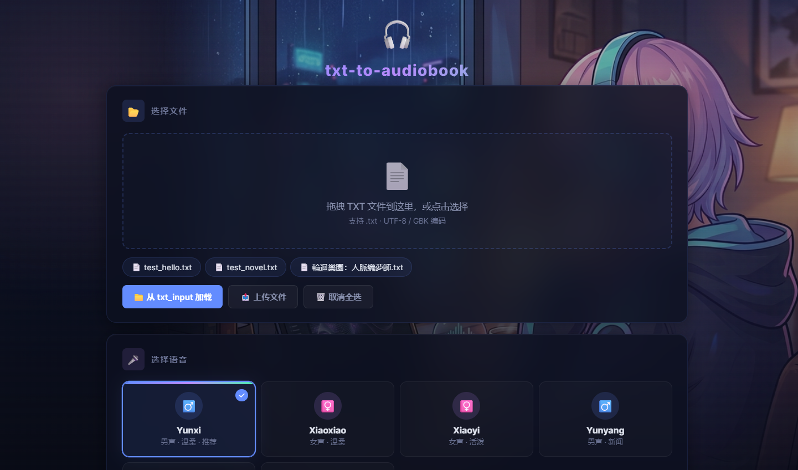
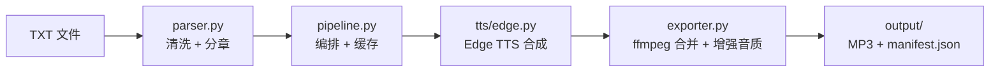

<p align="center">
  
</p>

<h1 align="center">🎧 txt-to-audiobook</h1>

<p align="center">
  <strong>把 TXT 小说转成 MP3 有声书，用 Edge TTS 免费合成，零 API Key</strong>
</p>

<p align="center">
  <a href="LICENSE"></a>
  <a href="https://www.python.org/downloads/"></a>
  <a href="https://github.com/rany2/edge-tts"></a>
</p>

<p align="center">
  
</p>

---

## 快速开始

```bash
git clone https://github.com/ZTCY/txt-to-audiobook.git
cd txt-to-audiobook
pip install edge-tts tqdm fastapi uvicorn python-multipart websockets
```

把 TXT 扔进 `txt_input/`，然后：

```bash
# Web 界面 ⭐ 推荐
python -m txt_to_audiobook.web

# 命令行交互
python -m txt_to_audiobook.cli

# 直接指定参数
python -m txt_to_audiobook.cli -i txt_input/novel.txt --voice zh-CN-YunxiNeural
```

浏览器打开 `http://127.0.0.1:8081`，拖拽 TXT 文件、选语音、开始转换。

> Windows 用户可以双击 `run_web.bat` 或 `run_cli.bat`，自动检测 Python、安装依赖、杀端口冲突。

MP3 输出在 `output/[书名]/`。

## 功能

- **自动分章** — 识别「第X章」「第X回」「Chapter X」「第X节」
- **长章分块** — 超过 1000 字的章节按标点断句，逐块合成后合并
- **断点续跑** — 已完成的 chunk 自动跳过，中断不浪费
- **实时控制** — 转换中随时暂停 / 继续 / 跳过 / 终止
- **6 种语音** — 云希、晓晓、晓伊、云扬、云健、云夏
- **语速调节** — `-20%` 到 `+20%`
- **章节范围** — 只转指定区间
- **ffmpeg 后处理** — 升频 48kHz / 320kbps + EBU R128 响度标准化
- **manifest.json** — 记录配置、耗时、成功/失败

## 语音列表

| 语音 | Short Name | 性别 | 风格 |
|------|-----------|------|------|
| 云希 ⭐ | `zh-CN-YunxiNeural` | 男 | 阳光（默认） |
| 晓晓 | `zh-CN-XiaoxiaoNeural` | 女 | 温暖 |
| 晓伊 | `zh-CN-XiaoyiNeural` | 女 | 活泼 |
| 云扬 | `zh-CN-YunyangNeural` | 男 | 专业 |
| 云健 | `zh-CN-YunjianNeural` | 男 | 热血 |
| 云夏 | `zh-CN-YunxiaNeural` | 男 | 可爱 |

语速建议：

| 语速 | 场景 |
|------|------|
| -20% ~ -5% | 学习、精听 |
| +0% | 正常听书（默认） |
| +5% ~ +20% | 快速浏览 |

```bash
# 查看全部可用的中文语音
python -m txt_to_audiobook.cli --list-voices
```

## CLI 参数

```
python -m txt_to_audiobook.cli [OPTIONS]

  -i, --input PATH        输入 TXT
  -o, --output PATH       输出目录（默认 ./output）
      --voice NAME        Short Name（默认 zh-CN-YunxiNeural）
      --rate RATE         语速（+0%, -10%, +20%）
      --start N           起始章节
      --end N             结束章节
      --dry-run           只预览不生成
      --list-voices       列出可用中文语音
```

预览模式：

```bash
python -m txt_to_audiobook.cli --dry-run -i examples/sample_zh.txt
```

```
📄 File: sample_zh.txt
📝 Characters: 676
📚 Chapters: 3
🧩 Chunks (TTS calls): 3
⏱️  Estimated: ~6s
```

## 项目结构

```
txt-to-audiobook/
├── src/txt_to_audiobook/
│   ├── cli.py            # 命令行入口
│   ├── web.py            # Web 界面（FastAPI + WebSocket）
│   ├── config.py         # 路径、语音列表
│   ├── models.py         # dataclass 数据模型
│   ├── parser.py         # 文本清洗、章节检测、分块
│   ├── pipeline.py       # 编排：暂停/停止、缓存、manifest
│   ├── exporter.py       # MP3 合并 + ffmpeg 后处理
│   ├── tts/
│   │   ├── base.py       # TTSProvider 抽象接口
│   │   └── edge.py       # Edge TTS 实现（重试 + 指数退避）
│   └── templates/
│       └── index.html    # Web UI 前端
├── assets/               # 背景图、截图、表情贴纸
├── tests/                # 单元测试（40 个）
├── examples/sample_zh.txt
├── run_web.bat           # Windows 一键启动 Web UI
├── run_cli.bat           # Windows 一键启动 CLI
└── LICENSE
```

## 架构



`TTSProvider` 是抽象接口，目前只有 `EdgeTTSProvider`。要接其他 TTS 引擎，只需新建实现类，pipeline 不用改。

## 音质增强

Edge TTS 免费接口上限为 96kbps / 24kHz。本项目通过 ffmpeg 后处理提升听感：

| 指标 | Edge TTS 原始 | 增强后 |
|------|-------------|--------|
| 比特率 | 96kbps | 320kbps |
| 采样率 | 24kHz | 48kHz |
| 响度 | 不一致 | EBU R128 标准化 |

> 需要系统安装 [ffmpeg](https://ffmpeg.org/download.html)。未安装时自动降级为原始输出，不影响使用。

## Web UI 表情贴纸

转换过程中，界面右下角的角色会根据状态切换表情：

| 贴纸 | 状态 | 表情 |
|------|------|------|
|  | 就绪 / 完成 | 开心点赞 |
|  | 暂停 | 温柔微笑 |
|  | 转换中 | 托腮聆听 |
|  | 错误 | 惊喜星星眼 |

## 背景图

`assets/bg.png` 是 Web UI 的全屏背景。直接替换文件即可换肤，无需改代码。

- 建议暗色调，1920×1080+，PNG 格式，< 2MB
- CSS：`background: var(--bg-deep) url('/assets/bg.png') center top / cover fixed no-repeat;`

## 常见问题

<details>
<summary>转不出声音？</summary>

检查网络。Edge TTS 走微软公共接口，不需要 API Key，但需要能连外网。
</details>

<details>
<summary>章节切错了？</summary>

TXT 的章节标题必须是「第X章」「第X回」「Chapter X」「第X节」之一。其他格式暂不支持。
</details>

<details>
<summary>中断后重跑会不会从头开始？</summary>

不会。pipeline 检查 `temp/` 下已有的 chunk，已完成的部分直接跳过，从断点继续。
</details>

<details>
<summary>pip install -e . 报编码错误？</summary>

路径含中文会触发 setuptools 编码问题。用 `PYTHONPATH` 代替：

```bash
set PYTHONPATH=src
python -m txt_to_audiobook.cli
```
</details>

<details>
<summary>试听音质比转换出来的差？</summary>

试听和转换输出都走相同的 ffmpeg 增强流程。如果试听听起来差，可能是浏览器缓存了旧版音频，Ctrl+F5 强刷一下。
</details>

## 致谢

- [edge-tts](https://github.com/rany2/edge-tts) — 微软 Edge TTS 的 Python 实现

## License

[MIT](LICENSE)
